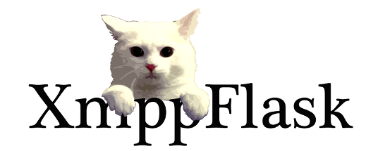

.. XmppFlask documentation master file, created by
   sphinx-quickstart on Sun Jul 24 00:45:44 2011.
   You can adapt this file completely to your liking, but it should at least
   contain the root `toctree` directive.

XmppFlask is easy to use XMPP framework that is inspired (heavily) by
`Flask <http://flask.pocoo.org>`_. It is intended to be as easy to use
as Flask itself is.

=========
XmppFlask
=========

-------------------------------
XmppFlask is easy to start with
-------------------------------

The main idea is to make you happy with writing small jabber bots. Like this:

.. code-block:: python

    from xmppflask import XmppFlask
    app = XmppFlask(__name__)

    @app.route(u'ping')
    def ping():
        return u'pong'

-----------
Source Code
-----------

Source code is available via bitbucket
`https://bitbucket.org/k_bx/xmppflask
<https://bitbucket.org/k_bx/xmppflask>`_.

------
Status
------

It's in status of ideal suitability for "use and help polishing it",
since some obvious improvements could be done.

-------
Authors
-------

Original author is `Konstantine Rybnikov
<http://redhotchilipython.com>`_. Current main developer is `Alexander
Shorin <https://bitbucket.org/kxepal>`_

Great thanks to contributors:

* `Brendan McCollam <https://bitbucket.org/bjmc>`_

Feel free to be the next one.

---------
Community
---------

Join us at jabber conference xmppflask@conference.jabber.org for
discussions. Homepage is located at `http://xmppflask.org
<http://xmppflask.org>`_.

-----------------------
Where should I go next?
-----------------------

You can go directly to :doc:`intro`.

Contents:

.. toctree::
   :maxdepth: 2
   
   intro
   overview

Indices and tables
==================

* :ref:`genindex`
* :ref:`modindex`
* :ref:`search`
