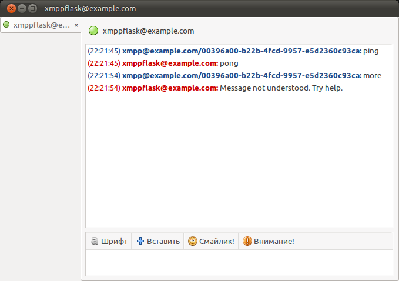

============
Introduction
============

XmppFlask is considered to be simple (it might be not there yet, but we are
constantly working no it).

So let's begin with "hello world" app.

------------
Installation
------------

.. note::

    We use `PyPy <http://pypy.org>`_ interpreter to run things, but you may
    want to use standard CPython instead.

Installing pypy
---------------

Go to http://pypy.org , download latest pypy, unpack it somewhere and make

.. code-block:: bash

    sudo ln -s /absolute/path/to/pypy/bin/pypy /usr/local/bin/pypy

Now create a virtual environment for you application. First install latest
virtualenv to do that:

.. code-block:: bash

    sudo easy_install --upgrade virtualenv

Then create an environment:

.. code-block:: bash

    mkdir ~/v
    virtualenv -p /usr/local/bin/pypy ~/v/ping-env

Now go ahead and activate that environment:

.. code-block:: bash

   source ~/v/ping-env/bin/activate

From now on you can install things and they will only harm your virtual
environment.

Installing XmppFlask
--------------------

Right now the simplest way is just to clone the source repository

.. code-block:: bash

    hg clone https://k_bx@bitbucket.org/k_bx/xmppflask
    cd xmppflask
    python setup.py install

--------------------------
Writing simple application
--------------------------

``cd`` to your project's folder (like ``~/workspace/pingpong`` and write file
called pingpong.py

.. code-block:: python

    # -*- coding: utf-8 -*-

    from xmppflask import XmppFlask
    app = XmppFlask(__name__)

    @app.route(u'ping')
    def ping():
        return u'pong'

This small app responses "pong" to every "ping" message it gets. Now we need
to run that somehow.

If you have `setuptools <http://pypi.python.org/pypi/setuptools>`_ package
installed the simplest way to run your XMPPWSGI app would be using `xmppflask`
console script. The other way to run your app is
``python path/to/xmppflask/run.py`` - `xmppflask` is just handy shortcut.

.. code-block:: bash

    xmppflask --jid xmppflask@example.com \
    --password isecretlyusedjango ./pingpong.py:app

.. note::

    You need to already have xmppflask@example.com jabber account with that
    strange password.

.. warning::

    Passing JID and his password as command line arguments may be not very
    secure idea. As alternative solution, you could set them via
    ``XMPPFLASK_JID`` and ``XMPPFLASK_PASSWORD`` environment variables. Also you
    may skip this arguments - they will be asked to be prompted from tty.

Now run that and you should see something like this:

.. code-block:: bash

    (xmpp)kost@kost-narwhal:~/workspace/pingpong$ xmppflask \
    --jid xmppflask@example.com --password isecretlyusedjango ./pingpong.py:app
    INFO:root:connecting...
    INFO:root:done.
    WARNING:root:Unable to establish secure connection - TLS failed!
    INFO:root:> bot started!

Now go ahead and write something to our bot. Pidgin can be your friend!

Great! Now you can go to :doc:`overview` page and see what else is there.
